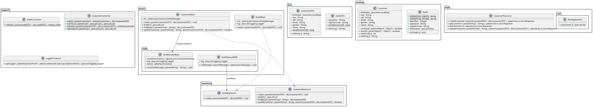

# [INATEL – Pós-graduação](https://inatel.br/) – [Desenvolvimento Mobile e Cloud Computing](https://inatel.br/pos/desenvolvimento-mobile-e-cloud-computing)
## Disciplina DM110 - Desenvolvimento Java EE
## Prof. Roberto Ribeiro Rocha
### Alunos [José Rodrigues](https://github.com/joseefrodriguesbr), [Taíbe Cruz](https://github.com/tandreycruz) e [Vagner Nogueira](https://github.com/vagnernogueira)
### Trabalho Final<br>


---
## Atividade proposta
[Tema 02 – Customer](https://docs.google.com/spreadsheets/d/1CC6jFGP3k89uZhc6hHTPNyscnzZDAcXrgJXq-6i50ko)


Serviços REST, Session Bean Stateless e Entities JPA para suportar as seguintes operações:

- inclusão de um registro
- busca de um registro através de seu identificador (ver sua entidade escolhida)
- listagem de registros
- atualização de um registro

Os serviços REST obrigatoriamente devem chamar o Session Bean para acessar o banco de dados.


O Session Bean deve chamar obrigatoriamente o serviço de mensagem (especificado abaixo) para ele efetuar o registro de auditoria.


O serviço de mensagem (MDB) deve efetuar um registro de auditoria:

- registrar todas as operações de alteração de dados realizadas e seus respectivos identificadores.


O MDB obrigatoriamente deve chamar um Session Bean para acessar o banco de dados.


---
## Class diagram


<br>

---
## Technology stack

- **[Java](https://www.java.com/pt-BR/) version 11**
- **[Maven](https://maven.apache.org/) version 3.X**
- **[Wildfly](https://www.wildfly.org/) version 30.0.X**
- **[Hsqldb](http://hsqldb.org/) version latest**

### IDE used
- **[Ecplise](https://www.eclipse.org/) version 2025-03**

---
### 1 - Download and Build

```bash

cd ~

git clone https://github.com/vagnernogueira/trabalho-dm110.git

cd trabalho-dm110

mvn clean install

```

---

### 2 - HSQLDB and Wildfly

```bash

project_dir=`pwd`

jdbc_driver_jar_path=$project_dir/docs/hsqldb-2.5.2.jar

java -jar $jdbc_driver_jar_path


```

Setting Name: customer-database

Type: HSQL Database Engine Standalone.

Driver: org.hsqldb.jdbc.JDBCDriver.

URL: jdbc:hsqldb:file:$project_dir/db/customer-database.db

User: dm110

Password: senhadm110


Copy contents of $project_dir/docs/script.sql

Paste on text box interface and press Execute SQL.


```bash

url_jdbc=jdbc:hsqldb:file:$project_dir/db/customer-database.db

cd $JBOSS_HOME/bin

# Start wildfly
./standalone.sh -c=standalone-full.xml

# Module
./jboss-cli.sh --connect --command="module add --name=br.inatel.dm110.org.hsqldb --dependencies=javax.transaction.api --export-dependencies=javax.api --resources=$jdbc_driver_jar_path"

# Driver
./jboss-cli.sh --connect --command="/subsystem=datasources/jdbcdriver=HSQLDBDriver:add(driver-name=HSQLDBDriver,driver-modulename=br.inatel.dm110.org.hsqldb,driver-class-name=org.hsqldb.jdbc.JDBCDriver)"

# Datasource
./jboss-cli.sh --connect --command="data-source add --jndi-name=java:/TrabalhoDM110DS --name=TrabalhoDM110DS --connection-url=$url_jdbc --driver-name=HSQLDBDriver --password=senhadm110 –user-name=dm110"

```

---
### 3 - Setting up the queue

```bash

./jboss-cli.sh --connect --command="jms-queue add --queue-address=dm110queue --durable=true --entries=[java:/jms/queue/dm110queue]"

```

---
### 4 - Deploy

```bash
ear_file_path=$project_dir/trabalho-ear/target/trabalho-ear-1.0.ear

./jboss-cli.sh --connect --command="deploy --force $ear_file_path"


```

---
### 5 - Postman collection (TODO)
- File: `[Trabalho-DM110.postman_collection](docs/Trabalho-DM110.postman_collection)`

---
### 6 - Undeploy

```bash

./jboss-cli.sh --connect --command="undeploy trabalho-ear-1.0.ear"

```

---
