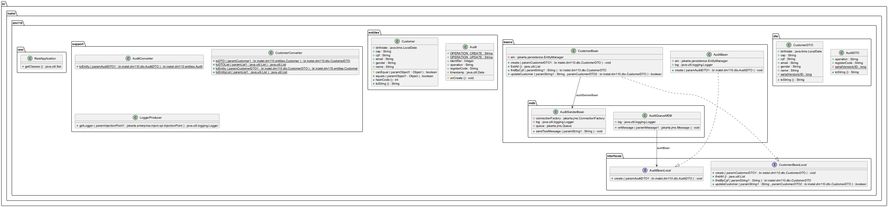

# Trabalho DM110
<br>

---
## [INATEL – Pós-graduação](https://inatel.br/) - [Desenvolvimento Mobile e Cloud Computing](https://inatel.br/pos/desenvolvimento-mobile-e-cloud-computing)
## Disciplina DM110 - Prof. Roberto Ribeiro Rocha
#### Alunos [José Rodrigues](https://github.com/joseefrodriguesbr), [Taíbe Cruz](https://github.com/tandreycruz) e [Vagner Nogueira](https://github.com/vagnernogueira)
#### Trabalho Final<br>

---
## Technology stack

- **[Java](https://www.java.com/pt-BR/) version 11**
- **[Maven](https://maven.apache.org/) version 3.X**
- **[Wildfly](https://www.wildfly.org/) version 30.0.X**
- **[Hsqldb](http://hsqldb.org/) version latest**

### IDE used
- **[Ecplise](https://www.eclipse.org/) version 2025-03**

---
### 1 - Download and Build

```bash

cd ~

git clone https://github.com/vagnernogueira/trabalho-dm110.git

cd trabalho-dm110

mvn clean install

```

---

### 2 - HSQLDB and Wildfly

```bash

project_dir=`pwd` && jdbc_driver_jar_path=$project_dir/docs/hsqldb-2.5.2.jar

java -jar $jdbc_driver_jar_path

```

*(TODO)*


  - Setting Name: DM110.
  - Type: HSQL Database Engine Standalone.
  - Driver: org.hsqldb.jdbc.JDBCDriver.
  - URL: `jdbc:hsqldb:file:$caminho_completo_do_arquivo_do_banco` (por exemplo:jdbc:hsqldb:file:/home/aluno/dm110-database/dm110.db).
  - User: SA
  - Password: sa
  
- Criar a tabela PURCHASE_ENTITY com o seguinte comando:

  ```sql
  CREATE TABLE PURCHASE_ENTITY (
    INVOICE_CODE VARCHAR(255) PRIMARY KEY,
    ORDER_ITEM VARCHAR(255),
    CPF VARCHAR(14),
    DATE_TIME TIMESTAMP,
    VALUE DOUBLE
  );
  ```
- Clique em `Execute SQL`, com isso a tabela PURCHASE_ENTITY será criada.

- Agora crie a tabela de auditoria:
  ```sql
  CREATE TABLE AUDIT_ENTITY (
    ID BIGINT IDENTITY PRIMARY KEY,
    REGISTER_CODE VARCHAR(255),
    OPERATION VARCHAR(255),
    CREATION_DATE TIMESTAMP
  );
  ```


```bash

# Start wildfly
cd $JBOSS_HOME/bin
./standalone.sh -c=standalone-full.xml

# Module
cd $JBOSS_HOME/bin
./jboss-cli.sh --connect --command="module add --name=br.inatel.dm110.org.hsqldb --dependencies=javax.transaction.api --export-dependencies=javax.api --resources=$jdbc_driver_jar_path"

# Driver
./jboss-cli.sh --connect --command="/subsystem=datasources/jdbcdriver=HSQLDBDriver:add(driver-name=HSQLDBDriver,driver-modulename=br.inatel.dm110.org.hsqldb,driver-class-name=org.hsqldb.jdbc.JDBCDriver)"

# Datasource
./jboss-cli.sh --connect --command="data-source add --jndi-name=java:/TrabalhoDM110DS --name=TrabalhoDM110DS --connection-url=jdbc:hsqldb:file:$db_path --driver-name=HSQLDBDriver --password=sa –user-name=SA"

```

---
### 3 - Setting up the queue

```bash

# Command to create Queue
./jboss-cli.sh --connect --command="jms-queue add --queue-address=dm110queue --durable=true --entries=[java:/jms/queue/dm110queue]"

```

---
### 4 - Deploy

```bash
ear_file_path=$project_dir/trabalho-ear/target/trabalho-ear-1.0.ear

./jboss-cli.sh --connect --command="deploy --force $ear_file_path"


```

---
#### 4.1 - Postman collection (TODO)
- File: `[TrabalhoDM110.postman_collection.json](docs/script.sql)`

---
### 4 - Undeploy

```bash

./jboss-cli.sh --connect --command="undeploy trabalho-ear-1.0.ear"

```

---
## Class diagram

<br>

---
